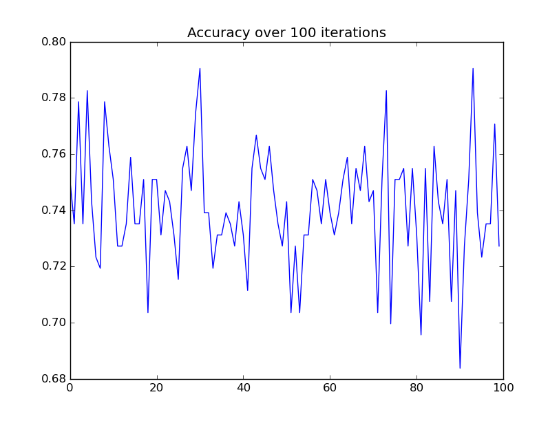
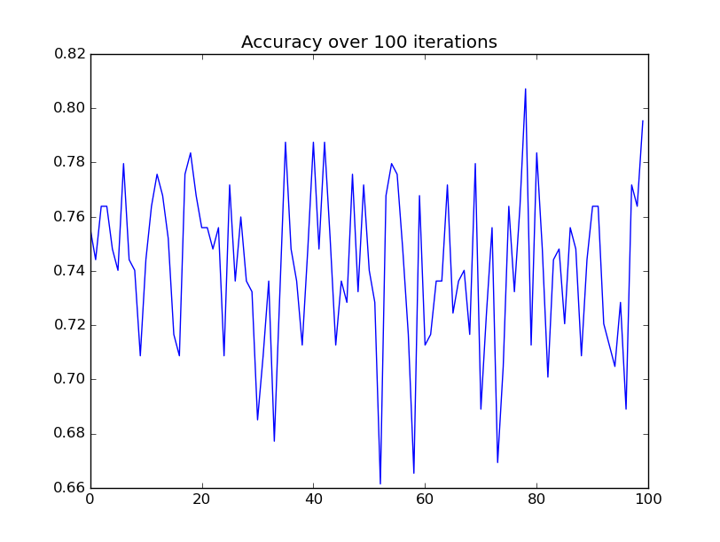
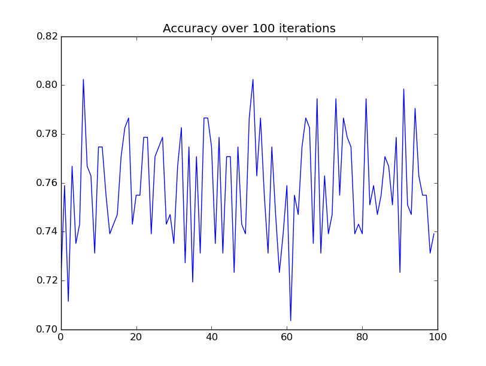

Implementation of [Gaussian Naive Bayes Classifier](https://en.wikipedia.org/wiki/Naive_Bayes_classifier)
Following [An Example by Jason Brownlee](http://machinelearningmastery.com/naive-bayes-classifier-scratch-python/)

##Verification:

###Custom Implementation

###Transcription from Source

###SKLearn GaussianNB

